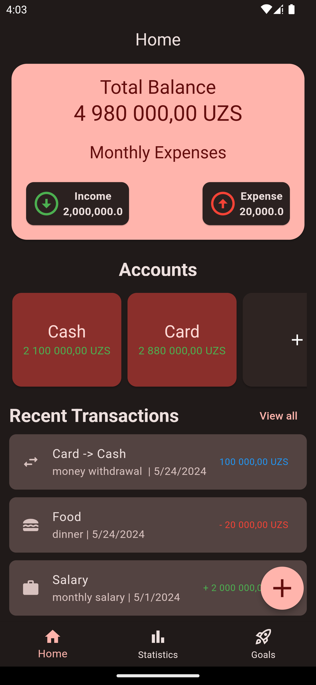
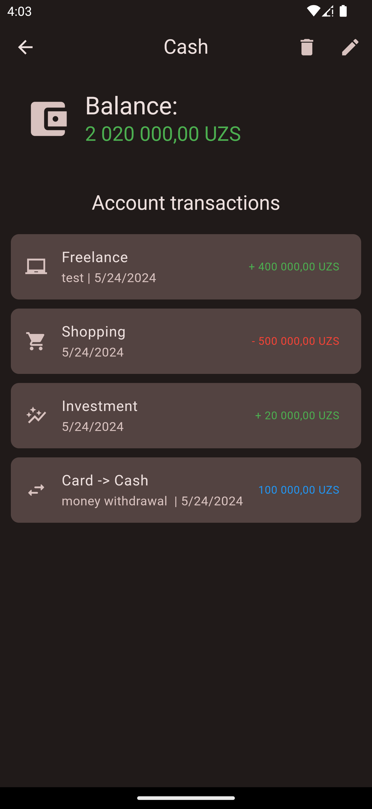
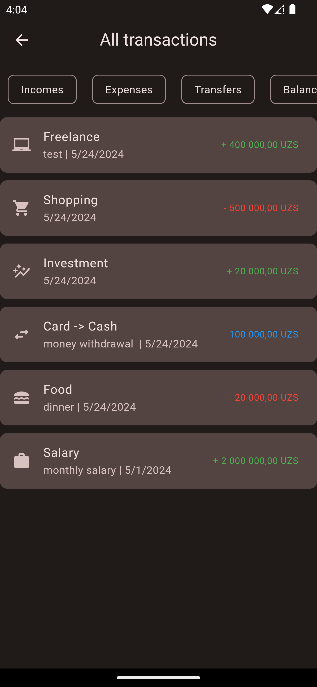
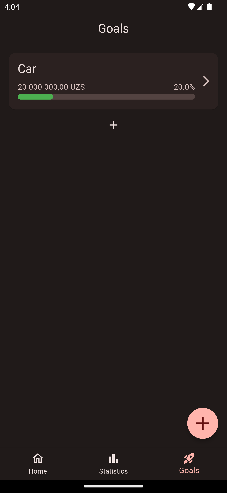
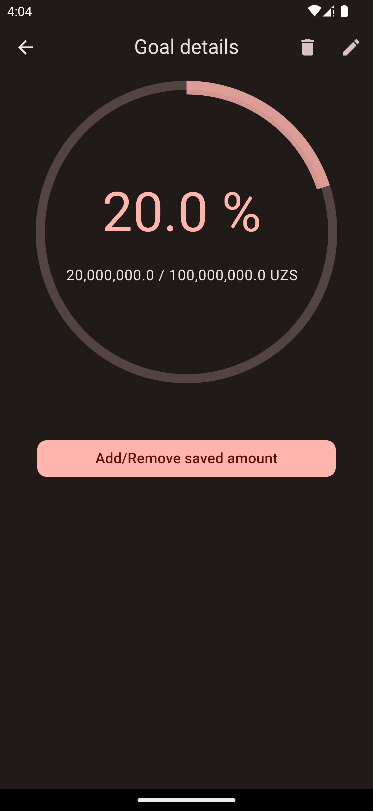
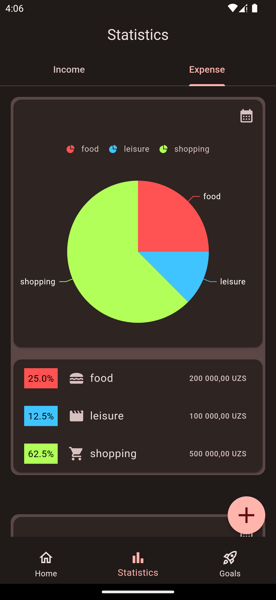
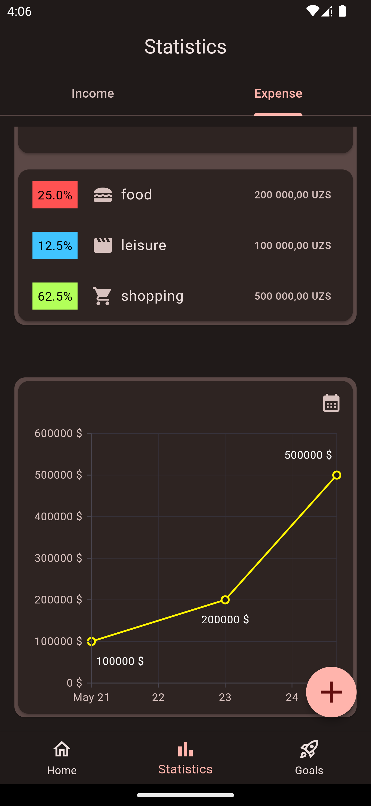
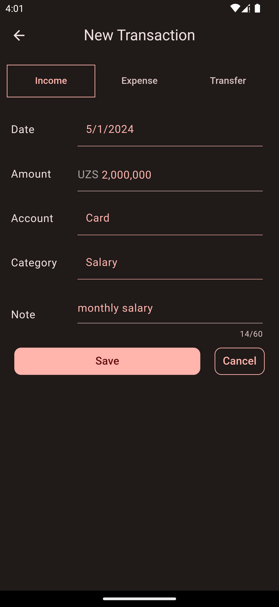

# Money Manager

Money Manager is a Flutter application designed to help you manage your finances efficiently. With this app, you can add multiple accounts (wallets), track your expenses and incomes, transfer money between accounts, and view simple statistics for a selected date range.

## Screenshots

  
  
  
  
  
  
  
  
  
  

## Core Features Implementation

### Local Database with `sqflite` package.
- The app stores all the information locally on the device only. This feature is implemented using a SQLite database managed with the `sqflite` package.

### Adding Multiple Accounts (Wallets)
- The app allows users to create multiple accounts, each representing a wallet.

### Tracking Transactions
- **Expense and Income Tracking:** Users can add expenses and incomes to their accounts. Each transaction is recorded in the database with relevant details such as amount, category, and timestamp.
- **Transfer:** Money transfer between accounts is facilitated by updating the balances of the sender and receiver accounts accordingly in the database.

### Viewing Simple Statistics
- **Implementation:** The app provides users with simple statistics for a selected date range. These statistics are generated using the data stored in the database and visualized using the `syncfusion_flutter_charts` package.

### State Management with Cubit
- **Implementation:** The app utilizes the Cubit pattern for state management. Each feature module, such as account management, transaction tracking, and statistics, has its own Cubit responsible for managing its state. This ensures a clean and organized codebase with clear separation of concerns.

## Development

The core features of Money Manager are implemented using Flutter and various packages to simplify development and enhance user experience.

## Contributing

Contributions are welcome! Please fork the repository and submit a pull request for any feature enhancements or bug fixes.

## Contact

For any inquiries, please contact [aisroilov1029@gmail.com](aisroilov1029gmail.com).